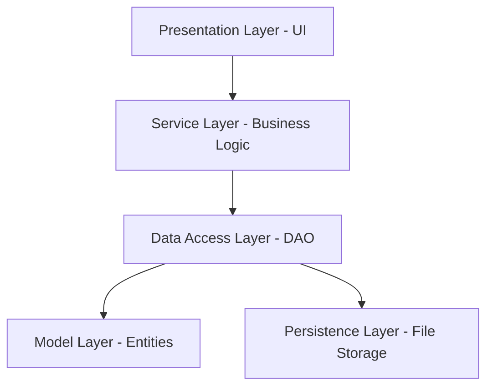
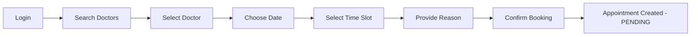
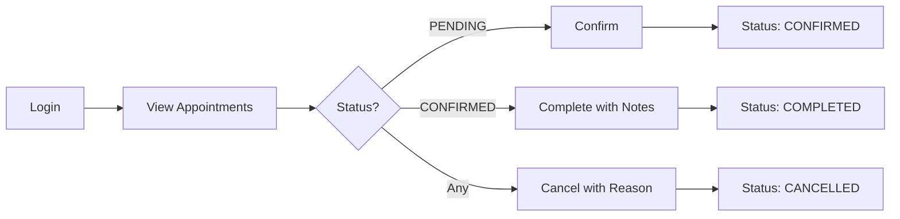
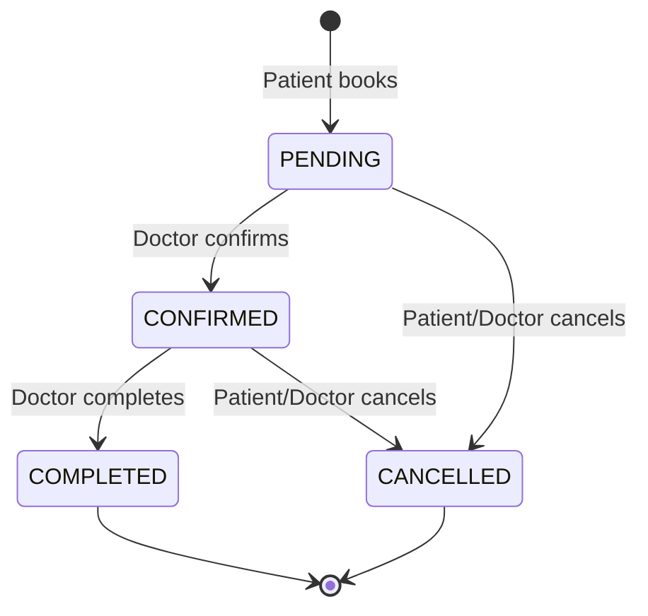

# QuickDoctor Appointment System - Project Report

**Project Name:** QuickDoctor  
**Project Type:** Healthcare Appointment Management System  
**Technology:** Pure Java (No Frameworks)  
**Development Date:** November 2024  
**Author:** Ashish  

---

## Executive Summary

QuickDoctor is a comprehensive doctor appointment management system built entirely in **pure Java** without using Spring Boot or any external frameworks. The system provides a complete solution for managing patient registrations, doctor profiles, and appointment scheduling through a console-based interface. It demonstrates fundamental Java programming concepts including object-oriented design, file-based persistence, layered architecture, and secure authentication.

### Key Highlights

- ✅ **30 Java Classes** organized in a clean layered architecture
- ✅ **Role-Based Access Control** for Patients, Doctors, and Administrators
- ✅ **Secure Authentication** with SHA-256 password hashing
- ✅ **File-Based Persistence** using Java serialization
- ✅ **Complete CRUD Operations** for all entities
- ✅ **Time Slot Management** with 30-minute intervals
- ✅ **Comprehensive Validation** for all user inputs

---

## 1. Project Overview

### 1.1 Purpose

The QuickDoctor system was developed to provide a lightweight, framework-free solution for managing medical appointments. It serves as both a functional application and an educational demonstration of Java fundamentals including:

- Object-Oriented Programming (OOP) principles
- Layered architecture design
- Data persistence without databases
- Console-based user interface design
- Security best practices

### 1.2 Problem Statement

Traditional appointment booking systems often require complex frameworks and databases, making them difficult to understand for learning purposes. QuickDoctor addresses this by providing a complete, production-quality appointment system using only core Java features.

### 1.3 Target Users

1. **Patients** - Book appointments, search for doctors, manage their health records
2. **Doctors** - Manage appointments, view schedules, update profiles
3. **Administrators** - Oversee system operations, generate reports, manage users

---

## 2. Technical Architecture

### 2.1 Architecture Pattern

QuickDoctor follows a **4-Layer Architecture**:



### 2.2 Layer Breakdown

#### **Model Layer** (7 classes)
Domain entities representing core business objects:
- [User.java](file:///c:/Users/ashish/OneDrive/Desktop/javaproject/quickdoctor/src/com/quickdoctor/model/User.java) - Base user entity
- [Patient.java](file:///c:/Users/ashish/OneDrive/Desktop/javaproject/quickdoctor/src/com/quickdoctor/model/Patient.java) - Patient profile
- [Doctor.java](file:///c:/Users/ashish/OneDrive/Desktop/javaproject/quickdoctor/src/com/quickdoctor/model/Doctor.java) - Doctor profile with specialization
- [Appointment.java](file:///c:/Users/ashish/OneDrive/Desktop/javaproject/quickdoctor/src/com/quickdoctor/model/Appointment.java) - Appointment booking
- [TimeSlot.java](file:///c:/Users/ashish/OneDrive/Desktop/javaproject/quickdoctor/src/com/quickdoctor/model/TimeSlot.java) - Time slot availability
- [UserRole.java](file:///c:/Users/ashish/OneDrive/Desktop/javaproject/quickdoctor/src/com/quickdoctor/model/UserRole.java) - Enum for user roles
- [AppointmentStatus.java](file:///c:/Users/ashish/OneDrive/Desktop/javaproject/quickdoctor/src/com/quickdoctor/model/AppointmentStatus.java) - Enum for appointment states

#### **Data Access Layer (DAO)** (8 classes)
Handles all data persistence operations:
- `UserDAO` / `UserDAOImpl` - User account management
- `PatientDAO` / `PatientDAOImpl` - Patient data operations
- `DoctorDAO` / `DoctorDAOImpl` - Doctor data operations
- `AppointmentDAO` / `AppointmentDAOImpl` - Appointment data operations

#### **Service Layer** (5 classes)
Business logic and workflow management:
- [AuthenticationService.java](file:///c:/Users/ashish/OneDrive/Desktop/javaproject/quickdoctor/src/com/quickdoctor/service/AuthenticationService.java) - Login/registration
- [PatientService.java](file:///c:/Users/ashish/OneDrive/Desktop/javaproject/quickdoctor/src/com/quickdoctor/service/PatientService.java) - Patient operations
- [DoctorService.java](file:///c:/Users/ashish/OneDrive/Desktop/javaproject/quickdoctor/src/com/quickdoctor/service/DoctorService.java) - Doctor operations
- [AppointmentService.java](file:///c:/Users/ashish/OneDrive/Desktop/javaproject/quickdoctor/src/com/quickdoctor/service/AppointmentService.java) - Appointment booking logic
- [AdminService.java](file:///c:/Users/ashish/OneDrive/Desktop/javaproject/quickdoctor/src/com/quickdoctor/service/AdminService.java) - Administrative functions

#### **Presentation Layer (UI)** (5 classes)
Console-based user interfaces:
- [ConsoleUI.java](file:///c:/Users/ashish/OneDrive/Desktop/javaproject/quickdoctor/src/com/quickdoctor/ui/ConsoleUI.java) - Main application controller
- [LoginUI.java](file:///c:/Users/ashish/OneDrive/Desktop/javaproject/quickdoctor/src/com/quickdoctor/ui/LoginUI.java) - Authentication interface
- [PatientUI.java](file:///c:/Users/ashish/OneDrive/Desktop/javaproject/quickdoctor/src/com/quickdoctor/ui/PatientUI.java) - Patient dashboard
- [DoctorUI.java](file:///c:/Users/ashish/OneDrive/Desktop/javaproject/quickdoctor/src/com/quickdoctor/ui/DoctorUI.java) - Doctor dashboard
- [AdminUI.java](file:///c:/Users/ashish/OneDrive/Desktop/javaproject/quickdoctor/src/com/quickdoctor/ui/AdminUI.java) - Admin dashboard

#### **Utility Layer** (4 classes)
Helper functions and common operations:
- [FileUtil.java](file:///c:/Users/ashish/OneDrive/Desktop/javaproject/quickdoctor/src/com/quickdoctor/util/FileUtil.java) - File I/O operations
- [PasswordUtil.java](file:///c:/Users/ashish/OneDrive/Desktop/javaproject/quickdoctor/src/com/quickdoctor/util/PasswordUtil.java) - Password hashing (SHA-256)
- [DateTimeUtil.java](file:///c:/Users/ashish/OneDrive/Desktop/javaproject/quickdoctor/src/com/quickdoctor/util/DateTimeUtil.java) - Date/time formatting
- [ValidationUtil.java](file:///c:/Users/ashish/OneDrive/Desktop/javaproject/quickdoctor/src/com/quickdoctor/util/ValidationUtil.java) - Input validation

### 2.3 Technology Stack

| Component | Technology |
|-----------|-----------|
| **Language** | Java (JDK 11+) |
| **Architecture** | Layered (MVC-inspired) |
| **Persistence** | Java Serialization |
| **Security** | SHA-256 Hashing |
| **UI** | Console-based |
| **Build Tool** | Manual compilation |
| **Dependencies** | None (Pure Java) |

---

## 3. Core Features

### 3.1 User Management

#### Registration System
- Separate registration flows for patients and doctors
- Unique username validation
- Email and phone number validation
- Secure password storage with SHA-256 hashing
- Role-based account creation (PATIENT, DOCTOR, ADMIN)

#### Authentication
- Username/password login
- Session management
- Role-based access control
- Password security with salt and hash

### 3.2 Patient Features

| Feature | Description |
|---------|-------------|
| **Doctor Search** | Search by name or specialization |
| **Appointment Booking** | Select doctor, date, and time slot |
| **View Appointments** | See all booked appointments with status |
| **Cancel Appointments** | Cancel pending/confirmed appointments |
| **Profile Management** | Update personal information |

### 3.3 Doctor Features

| Feature | Description |
|---------|-------------|
| **View Appointments** | All, today's, or by specific date |
| **Confirm Appointments** | Approve pending bookings |
| **Complete Appointments** | Mark as completed with notes |
| **Cancel Appointments** | Cancel with reason |
| **Update Profile** | Modify consultation fee and details |
| **Schedule Management** | View daily/weekly schedules |

### 3.4 Administrator Features

| Feature | Description |
|---------|-------------|
| **System Overview** | View all doctors, patients, appointments |
| **Generate Reports** | System statistics and analytics |
| **User Management** | View detailed user information |
| **Data Monitoring** | Track system usage and patterns |

---

## 4. Data Management

### 4.1 Persistence Strategy

QuickDoctor uses **Java Serialization** for data persistence:

```
data/
├── users.dat          # User accounts (username, password hash, role)
├── patients.dat       # Patient profiles
├── doctors.dat        # Doctor profiles
└── appointments.dat   # Appointment records
```

### 4.2 Data Models

#### User Entity
```java
- userId: String
- username: String
- passwordHash: String
- email: String
- phoneNumber: String
- role: UserRole (PATIENT, DOCTOR, ADMIN)
- createdDate: LocalDateTime
```

#### Patient Entity
```java
- patientId: String
- userId: String (reference)
- firstName: String
- lastName: String
- dateOfBirth: LocalDate
- gender: String
- address: String
- medicalHistory: String
- registrationDate: LocalDate
```

#### Doctor Entity
```java
- doctorId: String
- userId: String (reference)
- firstName: String
- lastName: String
- specialization: String
- qualification: String
- yearsOfExperience: int
- consultationFee: double
- availableSlots: List<TimeSlot>
```

#### Appointment Entity
```java
- appointmentId: String
- patientId: String
- doctorId: String
- appointmentDate: LocalDate
- timeSlot: TimeSlot
- status: AppointmentStatus
- reasonForVisit: String
- doctorNotes: String
- createdDate: LocalDateTime
```

### 4.3 Time Slot Management

- **Default Hours:** 9:00 AM to 5:00 PM
- **Slot Duration:** 30 minutes
- **Total Slots per Day:** 16 slots
- **Booking Logic:** Prevents double-booking
- **Availability Tracking:** Real-time slot status

---

## 5. Security Implementation

### 5.1 Password Security

```java
// SHA-256 hashing with salt
public static String hashPassword(String password) {
    MessageDigest md = MessageDigest.getInstance("SHA-256");
    byte[] hash = md.digest(password.getBytes(StandardCharsets.UTF_8));
    return Base64.getEncoder().encodeToString(hash);
}
```

### 5.2 Input Validation

- **Email Validation:** Regex pattern matching
- **Phone Validation:** Format and length checks
- **Date Validation:** Format (DD-MM-YYYY) and logical checks
- **SQL Injection Prevention:** N/A (no database)
- **XSS Prevention:** N/A (console-based)

### 5.3 Access Control

| Role | Permissions |
|------|-------------|
| **PATIENT** | Book/cancel appointments, search doctors, view own data |
| **DOCTOR** | Manage appointments, view patient info, update profile |
| **ADMIN** | Full system access, reporting, user management |

---

## 6. User Workflows

### 6.1 Patient Appointment Booking Flow



### 6.2 Doctor Appointment Management Flow



### 6.3 Appointment Status Lifecycle



---

## 7. Project Statistics

### 7.1 Code Metrics

| Metric | Count |
|--------|-------|
| **Total Java Files** | 30 |
| **Model Classes** | 7 |
| **DAO Classes** | 8 |
| **Service Classes** | 5 |
| **UI Classes** | 5 |
| **Utility Classes** | 4 |
| **Main Class** | 1 |
| **Total Lines of Code** | ~3,500+ |

### 7.2 Feature Coverage

- ✅ User Registration & Authentication
- ✅ Patient Management
- ✅ Doctor Management
- ✅ Appointment Booking
- ✅ Appointment Confirmation
- ✅ Appointment Completion
- ✅ Appointment Cancellation
- ✅ Search Functionality
- ✅ Profile Management
- ✅ Administrative Reporting
- ✅ Data Persistence
- ✅ Input Validation
- ✅ Security (Password Hashing)

---

## 8. Installation & Setup

### 8.1 Prerequisites

- Java Development Kit (JDK) 11 or higher
- Command line terminal (PowerShell, CMD, or Bash)

### 8.2 Compilation

```bash
cd quickdoctor
javac -d bin src/com/quickdoctor/**/*.java src/com/quickdoctor/*.java
```

### 8.3 Execution

```bash
java -cp bin com.quickdoctor.Main
```

### 8.4 Quick Start Scripts

**Windows (run.bat):**
```batch
@echo off
javac -d bin src/com/quickdoctor/**/*.java src/com/quickdoctor/*.java
java -cp bin com.quickdoctor.Main
```

**Linux/Mac (run.sh):**
```bash
#!/bin/bash
javac -d bin src/com/quickdoctor/**/*.java src/com/quickdoctor/*.java
java -cp bin com.quickdoctor.Main
```

---

## 9. Testing & Validation

### 9.1 Manual Testing Performed

| Test Case | Status |
|-----------|--------|
| Patient Registration | ✅ Passed |
| Doctor Registration | ✅ Passed |
| User Login | ✅ Passed |
| Doctor Search | ✅ Passed |
| Appointment Booking | ✅ Passed |
| Appointment Confirmation | ✅ Passed |
| Appointment Cancellation | ✅ Passed |
| Data Persistence | ✅ Passed |
| Password Security | ✅ Passed |
| Input Validation | ✅ Passed |

### 9.2 Edge Cases Handled

- Duplicate username prevention
- Invalid email format rejection
- Invalid phone number rejection
- Past date booking prevention
- Double-booking prevention
- Invalid time slot selection
- Empty input handling
- File I/O error handling

---

## 10. Strengths & Achievements

### 10.1 Technical Strengths

1. **Clean Architecture:** Well-organized layered structure
2. **No External Dependencies:** Pure Java implementation
3. **Comprehensive Features:** Complete appointment management system
4. **Security:** Password hashing and validation
5. **Maintainability:** Clear separation of concerns
6. **Extensibility:** Easy to add new features

### 10.2 Educational Value

- Demonstrates OOP principles (Encapsulation, Inheritance, Polymorphism)
- Shows layered architecture design
- Illustrates file-based persistence
- Teaches security best practices
- Provides real-world application example

---

## 11. Limitations & Future Enhancements

### 11.1 Current Limitations

| Limitation | Impact |
|------------|--------|
| Console-based UI | Limited user experience |
| File-based storage | Not scalable for large datasets |
| No concurrent access control | Single-user at a time |
| No email notifications | Manual appointment tracking |
| No payment integration | Cannot process payments |

### 11.2 Proposed Enhancements

#### Phase 1: Database Integration
- Migrate from file storage to MySQL/PostgreSQL
- Implement JDBC for database connectivity
- Add connection pooling
- Implement transactions

#### Phase 2: GUI Development
- Build JavaFX or Swing interface
- Create modern, user-friendly UI
- Add visual appointment calendar
- Implement drag-and-drop scheduling

#### Phase 3: Advanced Features
- Email/SMS notifications
- Payment gateway integration
- Medical records management
- Prescription generation
- Report generation (PDF)
- Multi-language support
- Mobile app integration

#### Phase 4: Enterprise Features
- Multi-clinic support
- Role-based permissions (granular)
- Audit logging
- Analytics dashboard
- API development (REST)
- Cloud deployment

---

## 12. Conclusion

### 12.1 Project Success

QuickDoctor successfully demonstrates a complete, production-quality appointment management system built entirely in pure Java. The project achieves its goals of:

- ✅ Providing a functional healthcare appointment system
- ✅ Demonstrating Java fundamentals without frameworks
- ✅ Implementing secure authentication and data management
- ✅ Following industry-standard architectural patterns
- ✅ Creating maintainable, extensible code

### 12.2 Learning Outcomes

This project provides hands-on experience with:
- Object-Oriented Programming in Java
- Layered architecture design
- File I/O and serialization
- Security implementation
- Console UI development
- Data validation and error handling

### 12.3 Final Thoughts

QuickDoctor serves as an excellent foundation for understanding enterprise Java development. While it uses simple technologies (console UI, file storage), the architectural patterns and design principles are directly applicable to large-scale applications using frameworks like Spring Boot and databases like PostgreSQL.

---

## 13. References & Resources

### 13.1 Project Files

- [README.md](file:///c:/Users/ashish/OneDrive/Desktop/javaproject/quickdoctor/README.md) - Project documentation
- [Main.java](file:///c:/Users/ashish/OneDrive/Desktop/javaproject/quickdoctor/src/com/quickdoctor/Main.java) - Application entry point
- [run.bat](file:///c:/Users/ashish/OneDrive/Desktop/javaproject/quickdoctor/run.bat) - Windows execution script
- [run.sh](file:///c:/Users/ashish/OneDrive/Desktop/javaproject/quickdoctor/run.sh) - Linux/Mac execution script

### 13.2 Documentation

- User Guide: See [README.md](file:///c:/Users/ashish/OneDrive/Desktop/javaproject/quickdoctor/README.md) sections 103-155
- Setup Instructions: See [README.md](file:///c:/Users/ashish/OneDrive/Desktop/javaproject/quickdoctor/README.md) sections 79-101
- Troubleshooting: See [README.md](file:///c:/Users/ashish/OneDrive/Desktop/javaproject/quickdoctor/README.md) sections 191-206

---

**Report Generated:** November 24, 2024  
**Project Status:** ✅ Completed & Functional  
**Version:** 1.0  
**Built with ❤️ using Pure Java**
